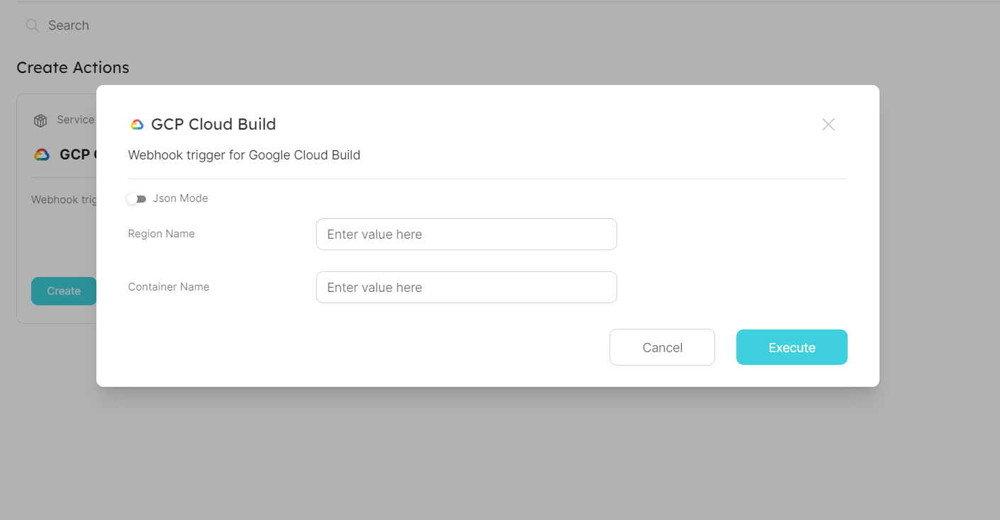

# Port Integration with CloudBuild

## Getting started

In this example you will create a self-service action for invoking a pipeline on Google Cloud Build. The pipeline builds a simple web app in the form of a container image, pushes it to container registry and deploys it to Cloud run. 

### CloudBuild config file
Place this example [config yaml file ](./cloudbuild.yaml) in your project's root folder

### Dockerfile
This file contains the Dockerfile which builds the project into a container

### Flask app
The `main.py` creates a simple Flask web app

#### Screenshot - Port Action

